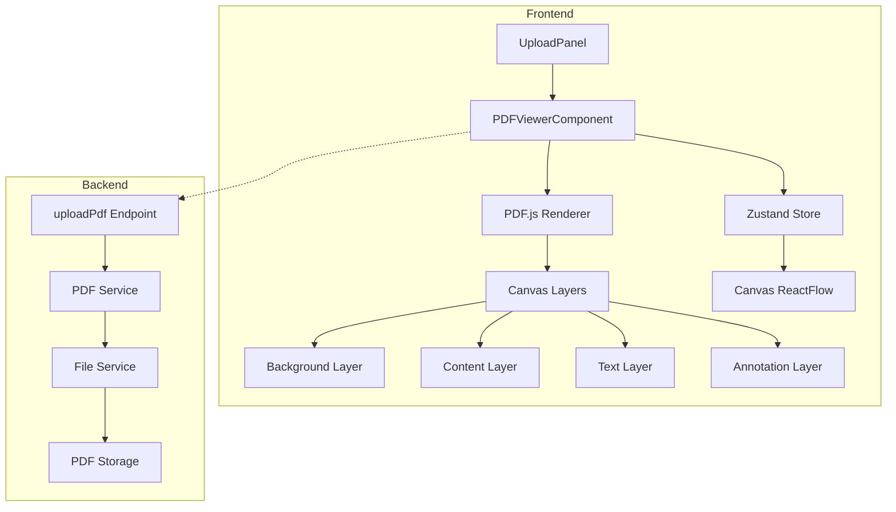

# PDF Viewer/Editor Architectural Redesign Plan

## Executive Summary

This document outlines a comprehensive plan to redesign the existing PDF viewer component to handle PDF rendering, image display, and mathematical notations with proper LaTeX/mathematical symbols support while preserving all content from uploaded PDFs.

---

## 1. Current Architecture Analysis

### 1.1 Existing System Components

| Component | Technology | Purpose |
|-----------|-----------|---------|
| **UploadPanel** | React + Axios | Handles PDF file upload to backend |
| **Backend PDF Processing** | PyMuPDF (pymupdf4llm) | Extracts text and markdown from PDFs |
| **ContentNode** | React + react-markdown | Displays extracted markdown content |
| **StudyNotePDF** | @react-pdf/renderer | Generates downloadable PDF study notes |
| **Canvas Store** | Zustand | Manages application state |

### 1.2 Current Limitations

1. **Content Loss**: Only text content is extracted; images, tables, graphs, and embedded objects (PowerPoint slides) are lost
2. **No PDF Rendering**: PDFs are converted to markdown, not rendered as-is
3. **Limited Math Support**: Mathematical notations may not render properly
4. **No Zoom**: Users cannot zoom in/out of content
5. **Scroll Position Not Retained**: Page scroll position is not preserved

---

## 2. Requirements Analysis

### 2.1 Functional Requirements

| ID | Requirement | Priority |
|----|-------------|----------|
| F1 | Render PDFs accurately (text, images, tables, graphs) | Critical |
| F2 | Preserve embedded objects (PowerPoint slides converted to PDF) | Critical |
| F3 | Support mathematical notations (LaTeX, equations) | Critical |
| F4 | Zoom functionality (in/out, fit to width/page) | High |
| F5 | Page navigation (previous/next, jump to page) | High |
| F6 | Scroll position memory per page | High |
| F7 | Text selection from rendered PDF | Medium |
| F8 | Search within PDF | Medium |

### 2.2 Non-Functional Requirements

| ID | Requirement | Priority |
|----|-------------|----------|
| NF1 | Performance: Fast initial load, smooth scrolling | High |
| NF2 | Browser compatibility (Chrome, Firefox, Safari, Edge) | High |
| NF3 | Error handling with user-friendly messages | High |
| NF4 | Loading states with progress indicators | High |
| NF5 | Fallback mechanisms for unsupported PDFs | Medium |

---

## 3. Library Evaluation

### 3.1 Evaluated Approaches

| Library | Pros | Cons | Recommendation |
|---------|------|------|----------------|
| **PDF.js (Mozilla)** | - Industry standard<br>- Excellent rendering accuracy<br>- Wide browser support<br>- Active maintenance<br>- Text layer support | - Complex setup<br>- No React integration out of the box | **Recommended** |
| **react-pdf** | - React-native feel<br>- Good text rendering<br>- Easy to use | - Limited image support<br>- Not suitable for viewing existing PDFs<br>- Better for creating PDFs | Not Recommended |
| **PDFLib** | - Powerful PDF manipulation<br>- Good for creation | - Not ideal for rendering<br>- No text selection | Not Recommended |
| **react-pdf-viewer** | - Complete solution<br>- Built-in toolbar | - Large bundle size<br>- Limited customization | Consider |

### 3.2 Selected Approach: PDF.js with Custom React Wrapper

**Rationale:**
1. **Rendering Accuracy**: PDF.js uses the same rendering engine as Firefox, ensuring high fidelity
2. **Content Preservation**: Native support for images, vectors, and embedded objects
3. **Text Selection**: Built-in text layer for selection and search
4. **Mathematical Notation**: PDF.js renders math expressions as they appear in the original
5. **Performance**: Efficient canvas-based rendering with viewport optimization
6. **Customization**: Full control over UI and behavior

---

## 4. Proposed Architecture

### 4.1 System Architecture Diagram



### 4.2 Component Architecture

```
frontend/src/components/
├── PDFViewer/
│   ├── PDFViewer.tsx          # Main viewer container
│   ├── PDFPage.tsx           # Individual page renderer
│   ├── PDFToolbar.tsx        # Zoom, navigation controls
│   ├── PDFThumbnailList.tsx  # Page thumbnails
│   ├── TextSelectionLayer.tsx # Text selection overlay
│   └── usePDFViewer.ts       # Custom hooks for PDF.js
├── ContentNode.tsx            # Modified to use PDFViewer
└── ...
```

### 4.3 Backend Architecture

```
backend/
├── services/
│   ├── pdf_service.py        # Existing (keep)
│   └── file_service.py       # Enhanced for PDF storage
├── routes/
│   └── upload.py             # Add PDF retrieval endpoint
└── ...
```

---

## 5. Implementation Plan

### Phase 1: Backend Modifications

| Step | Task | Files Modified |
|------|------|----------------|
| 1.1 | Add PDF file storage/retrieval | `backend/services/file_service.py` |
| 1.2 | Create PDF retrieval endpoint | `backend/routes/upload.py` |
| 1.3 | Update API response to include PDF URL | `backend/routes/upload.py` |

### Phase 2: Frontend PDF Viewer Component

| Step | Task | Files Modified |
|------|------|----------------|
| 2.1 | Install PDF.js | `frontend/package.json` |
| 2.2 | Create PDFViewer component | New: `frontend/src/components/PDFViewer/` |
| 2.3 | Implement page rendering | `PDFPage.tsx` |
| 2.4 | Add zoom controls | `PDFToolbar.tsx` |
| 2.5 | Add page navigation | `PDFToolbar.tsx` |
| 2.6 | Implement scroll position memory | `usePDFViewer.ts` |

### Phase 3: Integration with Existing Components

| Step | Task | Files Modified |
|------|------|----------------|
| 3.1 | Modify ContentNode to use PDFViewer | `frontend/src/components/ContentNode.tsx` |
| 3.2 | Update Canvas store for PDF data | `frontend/src/store/canvasStore.ts` |
| 3.3 | Preserve text selection for Q&A | `ContentNode.tsx`, `Canvas.tsx` |
| 3.4 | Update UploadPanel for new flow | `frontend/src/components/UploadPanel.tsx` |

### Phase 4: Fallback and Error Handling

| Step | Task | Files Modified |
|------|------|----------------|
| 4.1 | Add error boundaries | `PDFViewer/` components |
| 4.2 | Implement fallback to markdown view | `ContentNode.tsx` |
| 4.3 | Add loading states | `PDFViewer/` components |

---

## 6. State Management Changes

### 6.1 Updated Canvas Store

```typescript
interface FileData {
    markdown_content: string;    // Keep for Gemini queries
    raw_text: string;           // Keep for context
    filename: string;
    page_count: number;
    pdf_url?: string;           // NEW: URL for PDF file
    pdf_data?: ArrayBuffer;     // NEW: PDF binary data
}

interface CanvasState {
    // ... existing fields
    currentPage: number;
    zoomLevel: number;          // NEW: Current zoom level
    scrollPositions: Record<number, number>; // NEW: Per-page scroll
}
```

---

## 7. Backward Compatibility

### 7.1 Preserved Functionality

| Feature | Status | Notes |
|---------|--------|-------|
| PDF upload | ✅ | Enhanced to store PDF file |
| Text extraction | ✅ | Still used for Gemini queries |
| Q&A generation | ✅ | Works with extracted text |
| Flashcard generation | ✅ | Works with extracted text |
| Quiz generation | ✅ | Works with extracted text |
| PDF export | ✅ | Uses @react-pdf/renderer |
| Page navigation | ✅ | Enhanced with actual PDF |
| Text selection | ✅ | New text layer implementation |

### 7.2 New Features

| Feature | Description |
|---------|-------------|
| PDF Rendering | Actual PDF display with full fidelity |
| Image Preservation | All images from PDF visible |
| Graph/Tables | Vector graphics and tables preserved |
| Zoom | In/out/fit controls |
| Scroll Memory | Per-page scroll position saved |

---

## 8. Risk Mitigation

| Risk | Mitigation |
|------|------------|
| Large PDF files | Implement lazy loading, viewport-based rendering |
| Browser compatibility | Use PDF.js which has broad support |
| Memory usage | Implement page cleanup, limit cached pages |
| Math rendering issues | PDFs render math natively; fallback to text if needed |
| Existing tests break | Maintain backward compatibility |

---

## 9. Testing Strategy

1. **Unit Tests**: PDFViewer component logic
2. **Integration Tests**: Upload → Render → Interact flow
3. **E2E Tests**: Full user journey
4. **Performance Tests**: Large PDF handling
5. **Browser Tests**: Cross-browser validation

---

## 10. Conclusion

The proposed architecture using PDF.js provides the optimal balance between:
- **Rendering accuracy**: Native PDF rendering engine
- **Content preservation**: Full support for images, graphs, tables
- **Mathematical notation**: Native rendering of LaTeX/math
- **Integration**: Seamless fit with existing ReactFlow canvas
- **Performance**: Viewport-based lazy loading

This approach maintains all existing functionality while adding the requested PDF viewing capabilities.
